# Clawd in Twenty-Eight Styles

Clawd, the Claude Code mascot, drawn live in twenty-eight styles: from the cave wall to the lapel pin, and a few experiments beyond. Every line is drawn by code in your browser, with no images and no dependencies.

Unofficial fan art.

<table>
<tr><td align="center">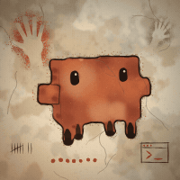<br><sub><b>01</b> Cave Painting</sub></td><td align="center">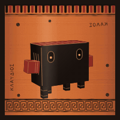<br><sub><b>02</b> Black-Figure</sub></td><td align="center">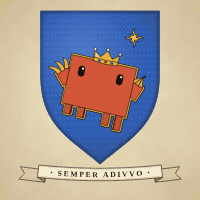<br><sub><b>03</b> Heraldry</sub></td><td align="center">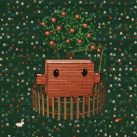<br><sub><b>04</b> Millefleur Tapestry</sub></td></tr>
<tr><td align="center">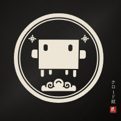<br><sub><b>05</b> Kamon</sub></td><td align="center">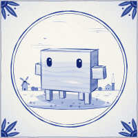<br><sub><b>06</b> Delftware</sub></td><td align="center">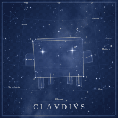<br><sub><b>07</b> Celestial Atlas</sub></td><td align="center">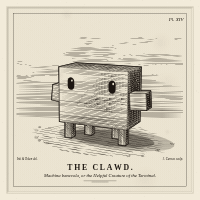<br><sub><b>08</b> Copperplate Engraving</sub></td></tr>
<tr><td align="center">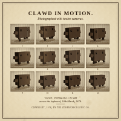<br><sub><b>09</b> Chronophotography</sub></td><td align="center">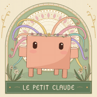<br><sub><b>10</b> Art Nouveau</sub></td><td align="center">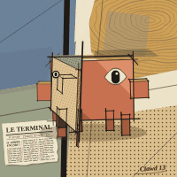<br><sub><b>11</b> Cubism</sub></td><td align="center">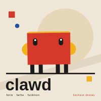<br><sub><b>12</b> Bauhaus</sub></td></tr>
<tr><td align="center">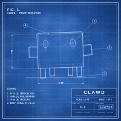<br><sub><b>13</b> Blueprint</sub></td><td align="center">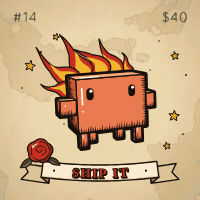<br><sub><b>14</b> Tattoo Flash</sub></td><td align="center">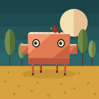<br><sub><b>15</b> Mid-Century Modern</sub></td><td align="center">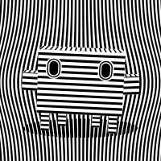<br><sub><b>16</b> Op Art</sub></td></tr>
<tr><td align="center">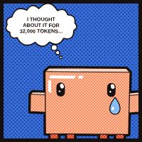<br><sub><b>17</b> Pop Art</sub></td><td align="center">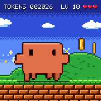<br><sub><b>18</b> Pixel Art</sub></td><td align="center">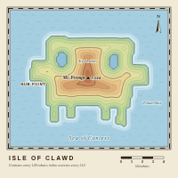<br><sub><b>19</b> Contour Map</sub></td><td align="center">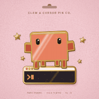<br><sub><b>20</b> Enamel Pin</sub></td></tr>
<tr><td align="center">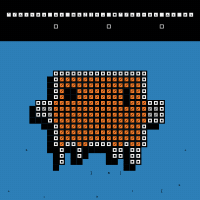<br><sub><b>21</b> Atlas Glyph Tiles</sub></td><td align="center">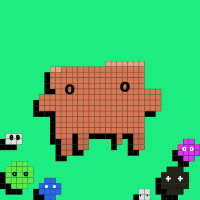<br><sub><b>22</b> Blob Mosaic</sub></td><td align="center">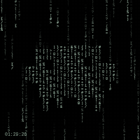<br><sub><b>23</b> Phosphor Streams</sub></td><td align="center">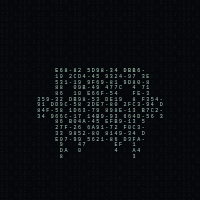<br><sub><b>24</b> Density Portrait</sub></td></tr>
<tr><td align="center">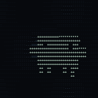<br><sub><b>25</b> Density Field</sub></td><td align="center">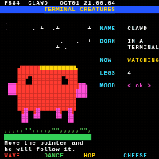<br><sub><b>26</b> Teletext Page</sub></td><td align="center">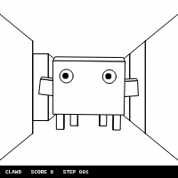<br><sub><b>27</b> Maze War</sub></td><td align="center">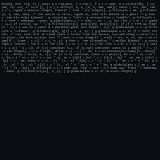<br><sub><b>28</b> Code Poem</sub></td></tr>
</table>

## Credits

- **Styles 1–20 and the whole engine** (the 3D mascot model, the rig that watches your cursor, the gallery): [ChetasLua](https://github.com/ChetasLua), from the original *Clawd in Twenty Styles*.
- **Styles 21–28** (`henrik-styles.js`): Henrik's experiments, eight looks from an upcoming project, re-drawn around Clawd. Only the look carries over.

| # | Style | After |
|---|---|---|
| 21 | Atlas Glyph Tiles | the FT "Atlas" glyph tiles, recoloured orange on azure |
| 22 | Blob Mosaic | tile-mosaic blobs with glyph eyes on one chapter ground |
| 23 | Phosphor Streams | phosphor glyph streams that stop at once |
| 24 | Density Portrait | an ASCII density portrait made of synthetic handles |
| 25 | Density Field | ertdfgcvb (Andreas Gysin), play.core |
| 26 | Teletext Page | Goto80's *Datagården* |
| 27 | Maze War | Maze War on the Xerox Alto |
| 28 | Code Poem | Kerr & Holden's *cold_cloud.cc*: the picture is made of letters taken from its own source code |

## Running it

Open `index.html` through any static server. A server is needed because the page loads `henrik-styles.js` as a separate file:

```bash
python -m http.server 8790
```

Then go to http://localhost:8790.

Controls: move the pointer and they watch you · click a tile to spin it · drag to turn it · **W** wave · **D** dance · **H** hop · **Space** say cheese.

Test views: `?grid=idle&cell=200` (every style in one pose), `?sheet=21,22&poses=idle,left,spin` (a pose sheet), `?solo=epoem&pose=idle&size=800` (one big tile).

## Regenerating the GIFs

With the static server running, `node tools/record-gifs.mjs` records every registered style into `media/` (needs Playwright and ffmpeg; set `NODE_PATH=$(npm root -g)` if Playwright is installed globally).

## Adding a style

Each style is one call:

```js
CM.style({ id, n, title, caption, init(env) { return state; }, draw(g, env, rig, state) { /* 400×400 tile */ } });
```

`CM.build(rig.pose, view)` returns the projected mascot (faces, eyes, hulls), and `CM.raster(M, cols, rows)` turns it into a grid of cells. The gallery shows every registered style in order of `n`.
