# Clawd in Forty-Eight Art Styles

Clawd, the Claude Code mascot, drawn live in forty-eight art styles: from the cave wall to the lapel pin, and a few experiments beyond. Every line is drawn by code in your browser, with no images and no dependencies.

Unofficial fan art, built on ChetasLua's [original gallery](https://claude.ai/artifact/TrrKcRKsCUtAFYzyhF6tDH).

<table>
<tr><td align="center"><br><sub><b>01</b> Cave Painting</sub></td><td align="center"><br><sub><b>02</b> Black-Figure</sub></td><td align="center"><br><sub><b>03</b> Heraldry</sub></td><td align="center"><br><sub><b>04</b> Millefleur Tapestry</sub></td></tr>
<tr><td align="center"><br><sub><b>05</b> Kamon</sub></td><td align="center"><br><sub><b>06</b> Delftware</sub></td><td align="center"><br><sub><b>07</b> Celestial Atlas</sub></td><td align="center"><br><sub><b>08</b> Copperplate Engraving</sub></td></tr>
<tr><td align="center"><br><sub><b>09</b> Chronophotography</sub></td><td align="center"><br><sub><b>10</b> Art Nouveau</sub></td><td align="center"><br><sub><b>11</b> Cubism</sub></td><td align="center"><br><sub><b>12</b> Bauhaus</sub></td></tr>
<tr><td align="center"><br><sub><b>13</b> Blueprint</sub></td><td align="center"><br><sub><b>14</b> Tattoo Flash</sub></td><td align="center"><br><sub><b>15</b> Mid-Century Modern</sub></td><td align="center"><br><sub><b>16</b> Op Art</sub></td></tr>
<tr><td align="center"><br><sub><b>17</b> Pop Art</sub></td><td align="center"><br><sub><b>18</b> Pixel Art</sub></td><td align="center"><br><sub><b>19</b> Contour Map</sub></td><td align="center"><br><sub><b>20</b> Enamel Pin</sub></td></tr>
<tr><td align="center"><br><sub><b>21</b> Atlas Glyph Tiles</sub></td><td align="center"><br><sub><b>22</b> Blob Mosaic</sub></td><td align="center"><br><sub><b>23</b> Phosphor Streams</sub></td><td align="center"><br><sub><b>24</b> Density Portrait</sub></td></tr>
<tr><td align="center"><br><sub><b>25</b> Density Field</sub></td><td align="center"><br><sub><b>26</b> Teletext Page</sub></td><td align="center"><br><sub><b>27</b> Maze War</sub></td><td align="center"><br><sub><b>28</b> Code Poem</sub></td></tr>
<tr><td align="center">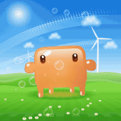<br><sub><b>29</b> Frutiger Aero</sub></td><td align="center">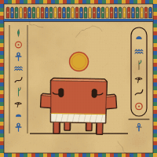<br><sub><b>30</b> Tomb Painting</sub></td><td align="center">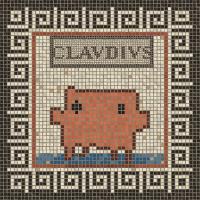<br><sub><b>31</b> Mosaic</sub></td><td align="center">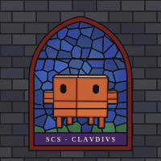<br><sub><b>32</b> Stained Glass</sub></td></tr>
<tr><td align="center">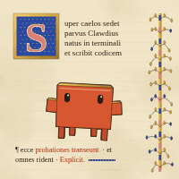<br><sub><b>33</b> Illuminated Initial</sub></td><td align="center">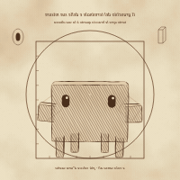<br><sub><b>34</b> Proportion Study</sub></td><td align="center">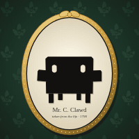<br><sub><b>35</b> Silhouette</sub></td><td align="center">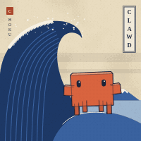<br><sub><b>36</b> Ukiyo-e</sub></td></tr>
<tr><td align="center">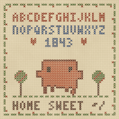<br><sub><b>37</b> Sampler</sub></td><td align="center">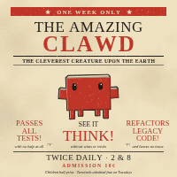<br><sub><b>38</b> Strongman Bill</sub></td><td align="center">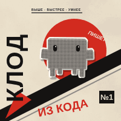<br><sub><b>39</b> Constructivism</sub></td><td align="center">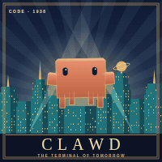<br><sub><b>40</b> Art Deco</sub></td></tr>
<tr><td align="center">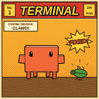<br><sub><b>41</b> Golden Age</sub></td><td align="center">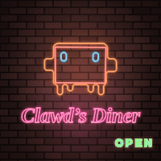<br><sub><b>42</b> Neon</sub></td><td align="center">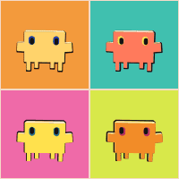<br><sub><b>43</b> Silkscreen</sub></td><td align="center">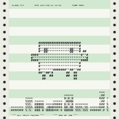<br><sub><b>44</b> Line Printer</sub></td></tr>
<tr><td align="center">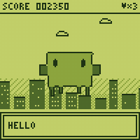<br><sub><b>45</b> Handheld</sub></td><td align="center">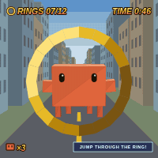<br><sub><b>46</b> Low Poly</sub></td><td align="center">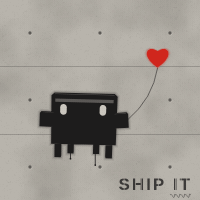<br><sub><b>47</b> Stencil</sub></td><td align="center">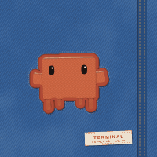<br><sub><b>48</b> Patch</sub></td></tr>
</table>

## Credits

- **Art styles 1–20 and the whole engine** (the 3D mascot model, the rig that watches your cursor, the gallery): [ChetasLua](https://github.com/ChetasLua), from the original [*Clawd in Twenty Styles*](https://claude.ai/artifact/TrrKcRKsCUtAFYzyhF6tDH).
- **Art styles 21–29** (`henrik-styles.js`): Henrik's experiments, nine looks from an upcoming project, re-drawn around Clawd. Only the look carries over.
- **Art styles 30–48** (`henrik-styles.js`): after the plates of *Superman in Flight*, a film that carries one hero through twenty plates of art history. Nineteen of those looks, re-drawn around Clawd (the petroglyph plate is left out, as 01 Cave Painting already covers it).

| # | Art style | After |
|---|---|---|
| 21 | Atlas Glyph Tiles | the FT "Atlas" glyph tiles, recoloured orange on azure |
| 22 | Blob Mosaic | tile-mosaic blobs with glyph eyes on one chapter ground |
| 23 | Phosphor Streams | phosphor glyph streams that stop at once |
| 24 | Density Portrait | an ASCII density portrait made of synthetic handles |
| 25 | Density Field | ertdfgcvb (Andreas Gysin), play.core |
| 26 | Teletext Page | Goto80's *Datagården* |
| 27 | Maze War | Maze War on the Xerox Alto |
| 28 | Code Poem | Kerr & Holden's *cold_cloud.cc*: the picture is made of letters taken from its own source code |
| 29 | Frutiger Aero | the glossy jelly avatars of *Frutiger Space* and *Frutiger Sanctuary*, after mid-2000s Frutiger Aero: sky swooshes, wind turbines, soap bubbles |
| 30 | Tomb Painting | Egyptian wall painting: flat earth pigments, a hieroglyph column, a cartouche and a sun disc |
| 31 | Mosaic | a Roman floor mosaic with a meander border and a lettered banner |
| 32 | Stained Glass | a Gothic lancet window, the figure cut into leaded panes |
| 33 | Illuminated Initial | a book of hours: a gilded initial, rubricated Latin, an ivy margin |
| 34 | Proportion Study | Leonardo's proportion drawings: circle, square, mirror writing, a ghost of the second pose |
| 35 | Silhouette | an 18th-century cut-paper silhouette in a gilt oval |
| 36 | Ukiyo-e | Hokusai's *Great Wave off Kanagawa* |
| 37 | Sampler | a Victorian cross-stitch sampler |
| 38 | Strongman Bill | a letterpress circus bill printed in red and black |
| 39 | Constructivism | a Soviet photomontage poster |
| 40 | Art Deco | a 1930s streamline city poster |
| 41 | Golden Age | a 1938 newsprint comic cover |
| 42 | Neon | a 1950s diner sign |
| 43 | Silkscreen | Warhol's four-up silkscreen portraits |
| 44 | Line Printer | ASCII art on greenbar printer paper |
| 45 | Handheld | a four-shade green handheld LCD |
| 46 | Low Poly | a late-90s polygon game with a ring to fly through |
| 47 | Stencil | spray-paint street stencil, with a heart balloon |
| 48 | Patch | an embroidered patch on denim |

## Running it

Open `index.html` through any static server. A server is needed because the page loads `henrik-styles.js` as a separate file:

```bash
python -m http.server 8790
```

Then go to http://localhost:8790.

Controls: move the pointer and they watch you · click a tile to spin it · drag to turn it · **W** wave · **D** dance · **H** hop · **Space** say cheese.

Test views: `?grid=idle&cell=200` (every art style in one pose), `?sheet=21,22&poses=idle,left,spin` (a pose sheet), `?solo=epoem&pose=idle&size=800` (one big tile).

## Regenerating the GIFs

With the static server running, `node tools/record-gifs.mjs` records every registered art style into `media/` (`IDS=stomb,spatch` records only those) (needs Playwright and ffmpeg; set `NODE_PATH=$(npm root -g)` if Playwright is installed globally).

## Adding an art style

Each art style is one call:

```js
CM.style({ id, n, title, caption, init(env) { return state; }, draw(g, env, rig, state) { /* 400×400 tile */ } });
```

`CM.build(rig.pose, view)` returns the projected mascot (faces, eyes, hulls), and `CM.raster(M, cols, rows)` turns it into a grid of cells. The gallery shows every registered art style in order of `n`.

## Fork it, add to it

Feel free to fork this repo and make it your own, or send a pull request with a new art style (or anything else). Every addition is welcome.

## License

[MIT](LICENSE), covering the code in this repository. The Clawd character and the Claude name belong to Anthropic; this is unofficial fan art and the license grants no rights to the character or marks.
